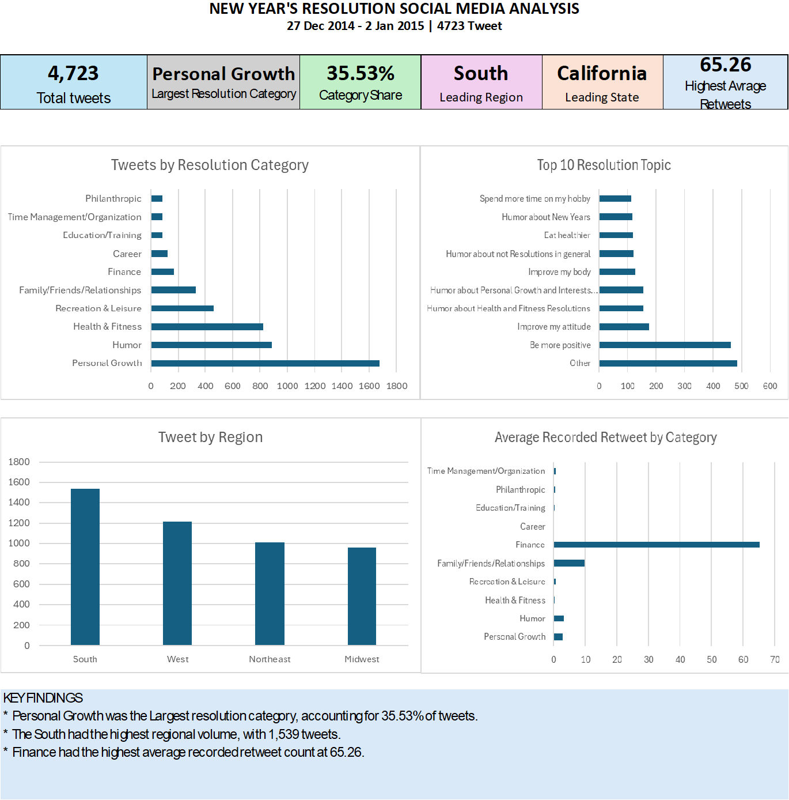

# new-years-resolution-analysis

An Excel-based analysis of 4,723 social media posts about New Year's resolutions, examining resolution categories, popular topics, geographic distribution, gender, and retweet engagement.

## Project Overview

This project analyzes 4,723 social media posts collected between **27 December 2014 and 2 January 2015**.

The goal was to clean and analyze the dataset using Microsoft Excel, identify patterns in people's New Year's resolutions, and present the findings through an interactive dashboard.

The analysis focuses on:

* What types of resolutions were most common?
* Which resolution topics appeared most frequently?
* How were the tweets distributed across states and regions?
* How was the dataset distributed by gender?
* Which resolution categories received the highest average retweet engagement?

## Tools & Skills

* Microsoft Excel
* Data Cleaning
* Data Transformation
* PivotTables
* Descriptive Analysis
* Data Aggregation
* Data Visualization
* Dashboard Development
* Insight Generation

## Data Cleaning

The dataset was reviewed and prepared in Excel before analysis.

The cleaning process included:

* Checking for missing values
* Identifying and reviewing duplicate records
* Standardizing text and location values
* Reviewing incomplete timezone and retweet-count fields
* Organizing resolution categories and topics
* Preparing fields for analysis and visualization

## Analysis

The analysis examined five main areas:

### 1. Resolution Categories

The tweets were grouped into categories to identify the types of resolutions people discussed most frequently.

### 2. Resolution Topics

The most frequently mentioned individual resolution topics were analyzed to identify common themes.

### 3. Geographic Distribution

Tweets were examined by state and region to identify where the resolutions in the dataset were concentrated.

### 4. Gender Distribution

The dataset was compared by gender to examine the distribution of tweets between female and male users.

### 5. Retweet Engagement

Retweet counts were analyzed as an engagement measure to identify categories with higher average levels of engagement.

## Key Findings

### Resolution Categories

**Personal Growth** was the largest resolution category, with **1,678 tweets (35.53%)**.

**Philanthropic** resolutions were the least represented category, with **83 tweets (1.76%)**.

### Popular Topics

Among the top topics analyzed, **"Other"** had the highest count with **483 tweets**, followed by **"Be more positive"** with **463 tweets**.

### Geographic Distribution

The **South** had the highest number of tweets among the four regions, with **1,539 tweets**.

At the state level, **California** had the highest number of tweets, with **701**.

### Gender Distribution

The gender distribution was almost evenly split:

* Female: **2,367 tweets**
* Male: **2,356 tweets**

This represents a difference of only 11 tweets between the two groups.

### Retweet Engagement

Among tweets with recorded retweet counts, the **Finance** category had the highest average engagement at approximately **65.26 retweets per tweet**.

## Dashboard

The dashboard brings the main findings together in one view, covering resolution categories, topics, geographic distribution, gender, and retweet engagement.

## Dataset

The dataset contains **4,723 records and 10 columns** covering information such as:

* Tweet details
* Resolution category
* Resolution topic
* Location
* State
* Region
* Gender
* Timezone
* Retweet count

The original dataset is included in this repository as:

`New_years_resolutions.csv`

## Project Files

| File                                               | Description                                                                   |
| -------------------------------------------------- | ----------------------------------------------------------------------------- |
| `New_years_resolutions.csv`                        | Original dataset used for the analysis                                        |
| `New Year's Resolution Social Media Analysis.xlsm` | Excel workbook containing the cleaning, analysis, calculations, and dashboard |
| `dashboard.png`                                    | Exported image of the final dashboard                                         |
| `README.md`                                        | Project documentation                                                         |

## Limitations

The dataset covers a short period from **27 December 2014 to 2 January 2015**. Therefore, the findings describe patterns within this dataset and should not be treated as a representation of current social media behavior.

Some fields also contain missing values, including timezone and retweet-count information. Retweet engagement analysis therefore focuses on records with available retweet counts.

The results should be interpreted as descriptive findings from the available sample rather than conclusions about all social media users.

## What I Learned

This project strengthened my practical experience with Excel-based data analysis, particularly in:

* Cleaning and preparing raw data
* Working with categorical and numerical data
* Using PivotTables to summarize large datasets
* Comparing groups and distributions
* Calculating and interpreting engagement measures
* Building a dashboard from analytical findings
* Turning numerical results into clear insights

## Author

**ISOLA JOSIAH KAYODE**

Aspiring Data Analyst
